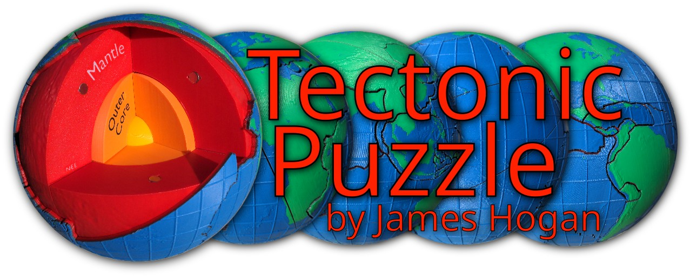

Tectonic Plates Puzzle for 3D Printing
======================================

This project is to create a 20cm diameter 3D printable magnetic globe puzzle of
the Earth's tectonic plates and internal structure. This is a little smaller
than a 10-pin bowling ball, and consists of the following parts:

 - 2 labelled yellow inner core hemispheres, attached together magnetically.
    
   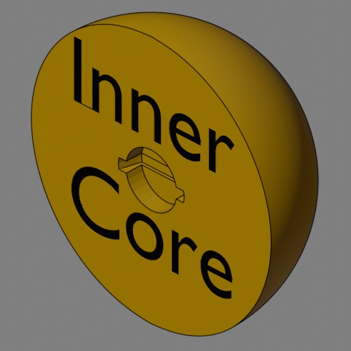
   
 - 4 labelled orange outer core quadrants.
    
   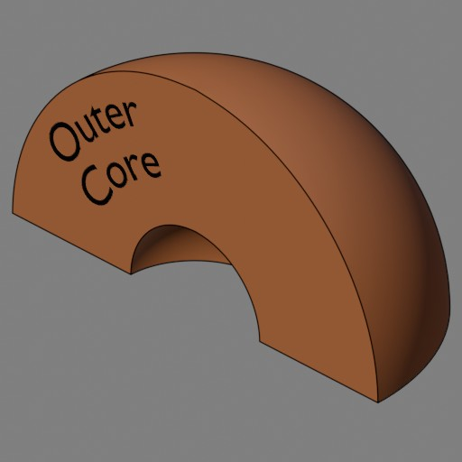
   
   
   
   - No magnetic attachment (the outer core is liquid after all).
 - 8 unique labelled red mantle segments, attached together magnetically.
    
   
   
   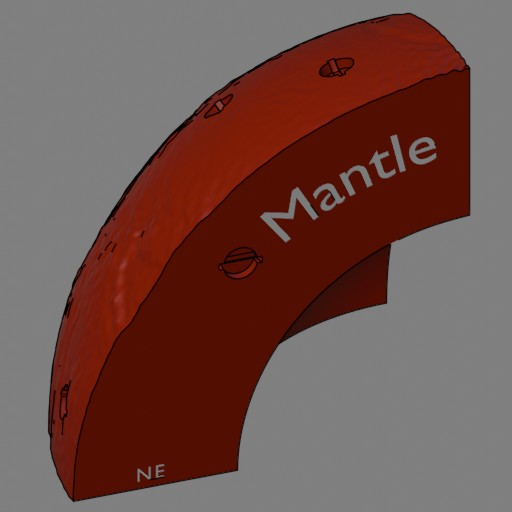
   
   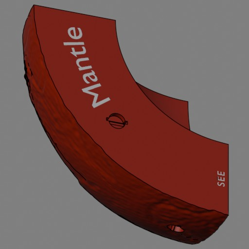
   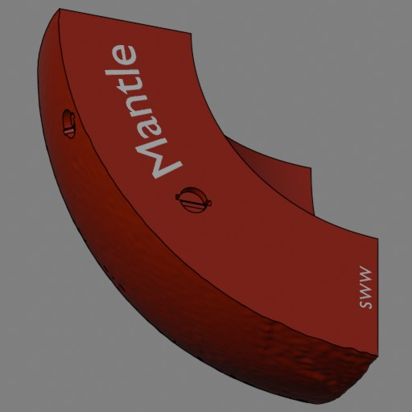
   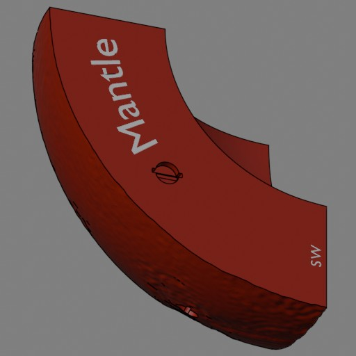
   
   - Each is additionally uniquely labelled, to aid quick assembly:
     - The first letter is "N" for Northern hemisphere or "S" for Southern
       hemisphere.
     - The second letter is "E" for Eastern hemisphere or "W" for Western
       hemisphere.
     - The second letter may be repeated for far east or far west segments, i.e.
       the night-time hemisphere at noon GMT.
   - Each has 3 magnet slots to attach to 3 other mantle segments.
   - Each has magnet slots to attach the 28 tectonic plate pieces to.
   - The outside shape corresponds to the approximate shape of the Moho
     discontinuity, the boundary between the mantle and the crust, vertically
     exaggerated 5x.
 - 28 colourful tectonic plate pieces, magnetically attached to the mantle
   segments, on a single 256mm build plate.
   - 20 main plate groups. Micro-plates that are too small for magnets are
     physically connected to neighbouring plates, but separated by a trench to
     mantle depth.
      
     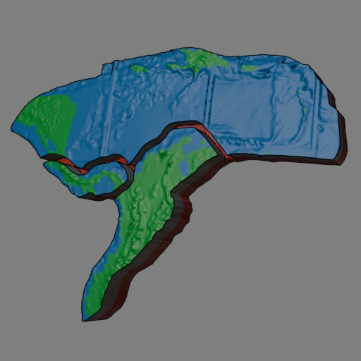
     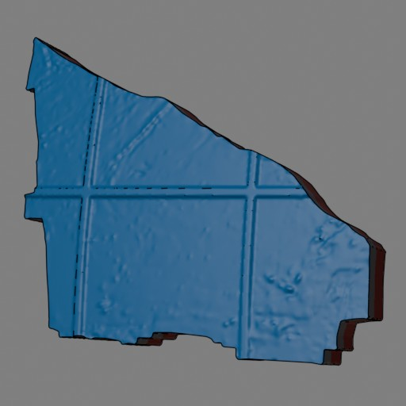
     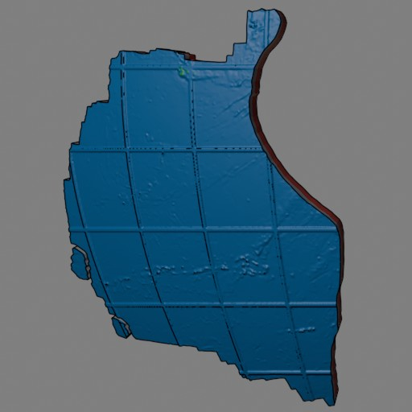
     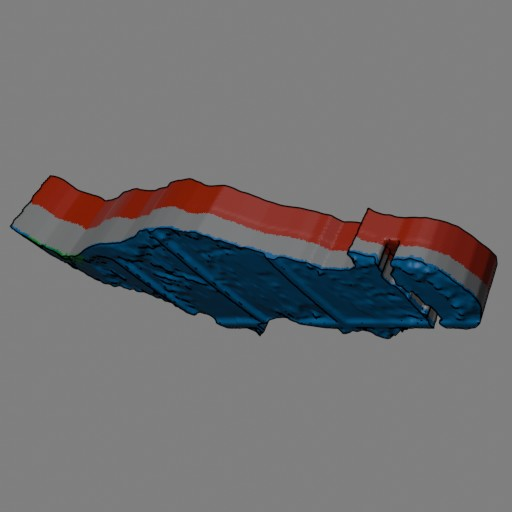
     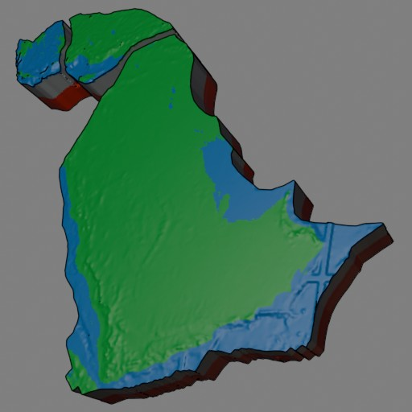
     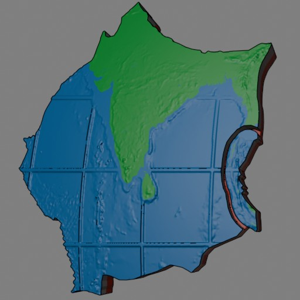
     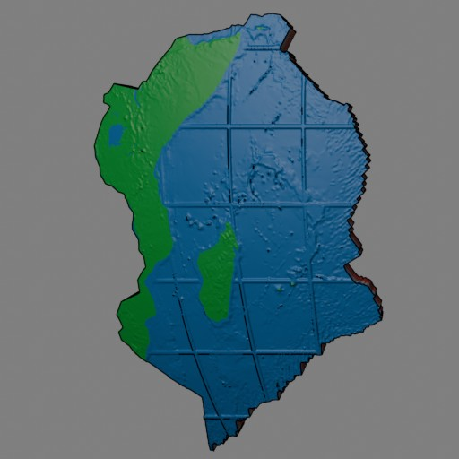
     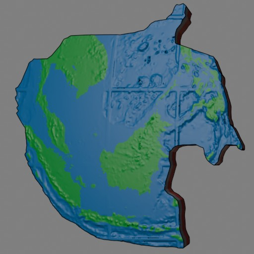
     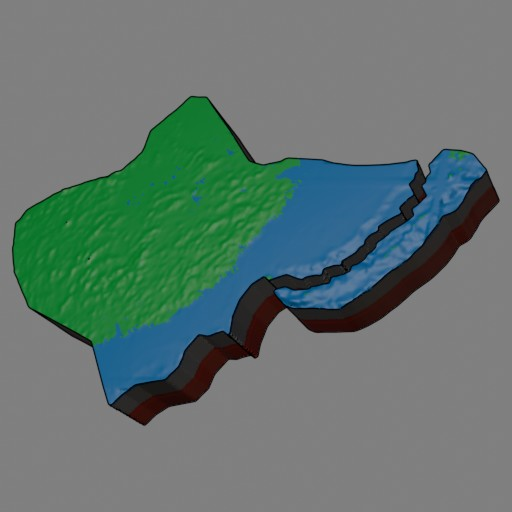
     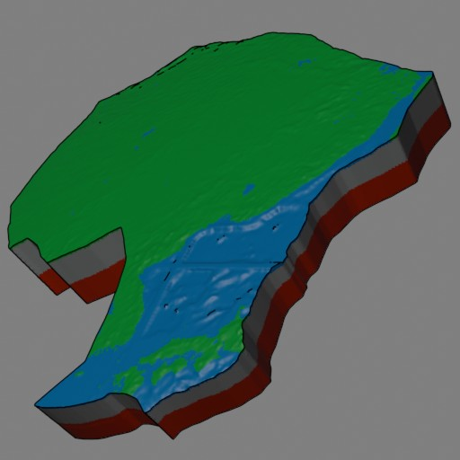
     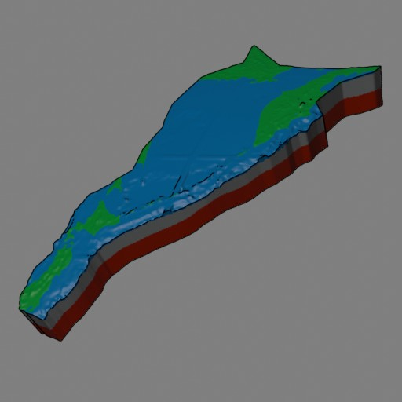
     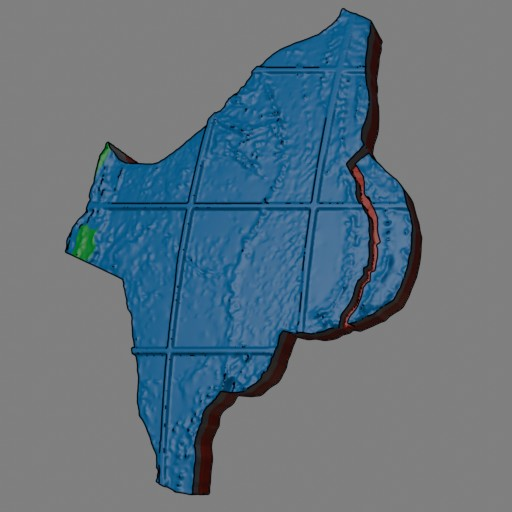
     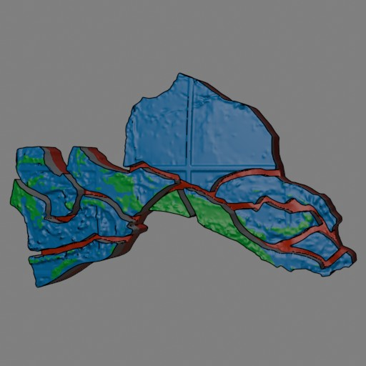
   - 6 major plate groups are split in halves long-ways to reduce wastage due to
     filament changes during printing.
      
     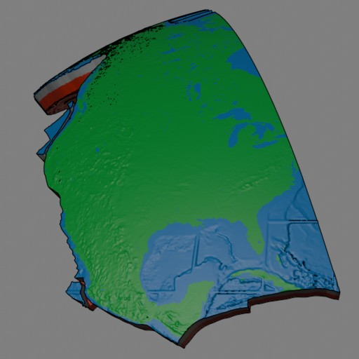
     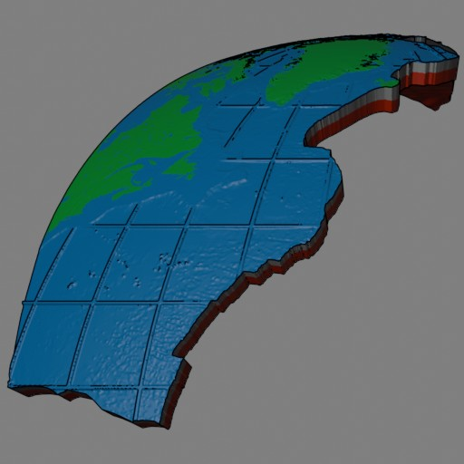
     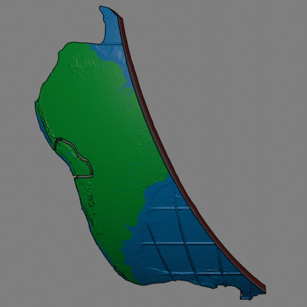
     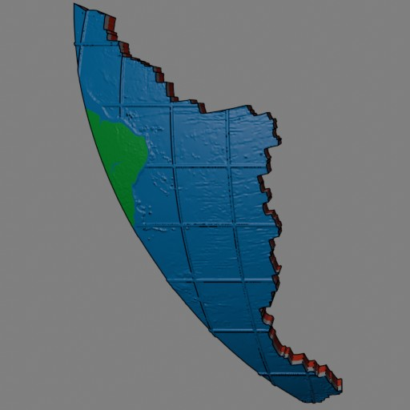
     
     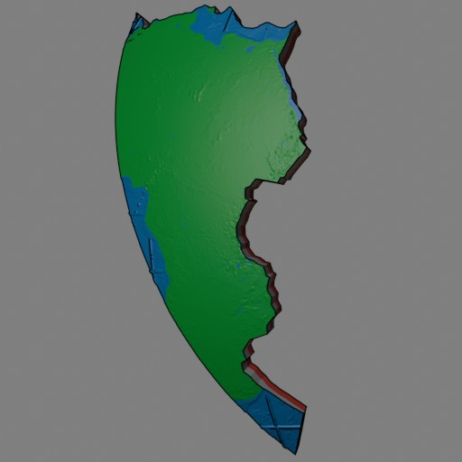
     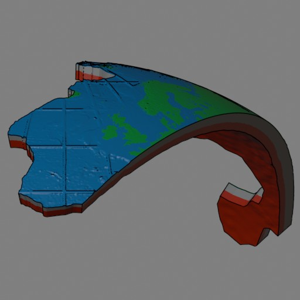
     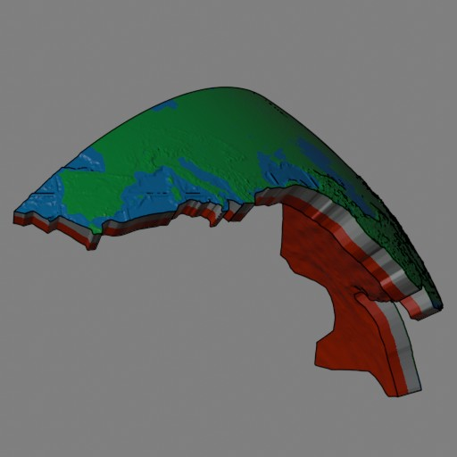
     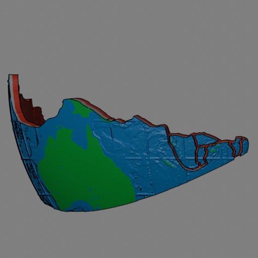
     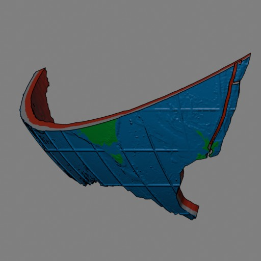
     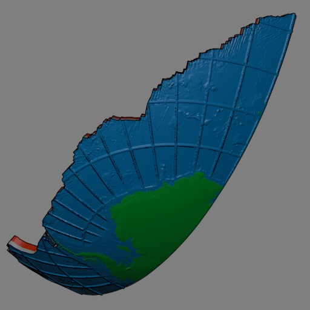
     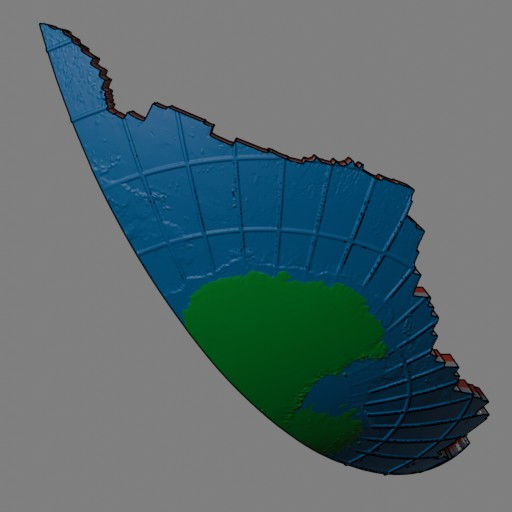
   - The Pacific plate is split into thirds.
      
     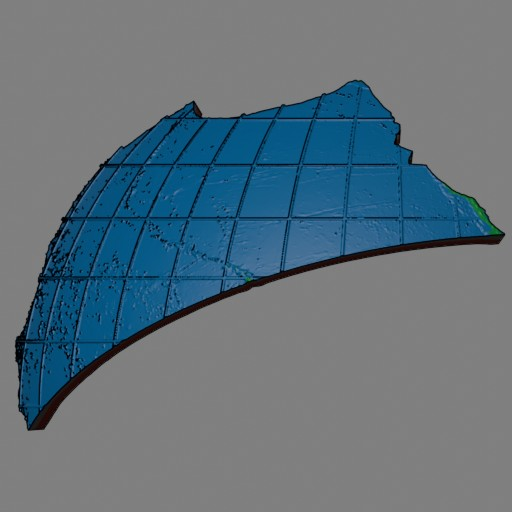
     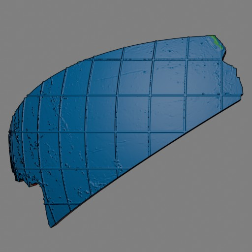
     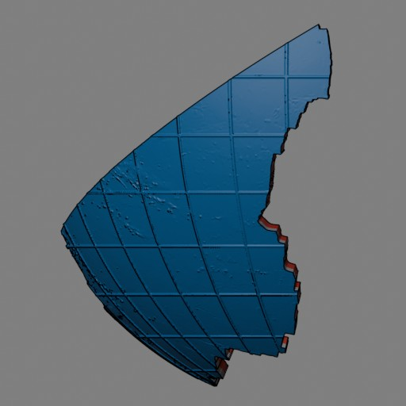
   - A fixed depth of mantle is embedded in each piece to allow space for
     magnets and to physically connect grouped microplates.
   - Each is shaped corresponding to the topology of the land and ocean floor,
     and the depth of the Moho discontinuity, to fit against the mantle
     segments.
     - Lines of latitude and longitude at 10 degree intervals in the ocean are
       raised to sea level, allowing both the topology of the sea floor and the
       depth of the ocean to be seen.
     - Topology is vertically exaggerated 5x to make it more visible.
     - High frequency surface topology (e.g. mountains) in the 5400x2700 DEM are
       exaggerated a further 2x relative to a 1/7.5 scaled down 720x360 DEM.
       This exaggerates fine features without scaling up the larger features or
       plate depths.

The tectonic plate pieces are multi-coloured on all sides. The colours have been
limited to 4 (as supported by the BambuLab AMS lite) with the following colours
being prioritised:
 - Blue represents the sea floor. This is important to distinguish land and sea,
   and allow recognition of familiar landmasses & oceans.
 - Green represents land (including Ice & Sand, such as Antarctica). This is the
   recognisable colour associated with land, and makes the whole thing
   pleasantly colourful.
 - Dark grey represents crust, allowing the relative crust depth to be visible
   on the sides of the plates. Though not heavily used, its an important aspect
   of the model to represent the thickness of the crust, and representing crust
   with green to allow for other colours wouldn't look right.
 - Red represents mantle. Each plate must embed a fixed depth of mantle to
   increase its thickness (especially thin oceanic crust).

The data and geometry nodes exist in the blend file to generate colouring for
sand and ice, however these haven't been used due to the priorities described
above.

The mantle and core segments limit multi-colour to the first few layers for
text labels. The colours are chosen to approximate relative heat, however they
make no attempt to precisely match any colour temperatures of inner parts of
the earth:
 - The mantle is red with white text, matching the underside of the tectonic
   plate pieces.
 - The outer core is orange with black text.
 - The inner core is yellow with black text.

Note that due to a few small parts and the use of strong magnets, this model is
not suitable for young children.

Print Guide
===========

3D printing of this model by others for fun or profit is encouraged, as is
making improvements to it, please refer to [License](#license) for details.

For printing, please download the 3MF file from the latest release on Github
rather than the source files in this repository. See the [Print
Guide](docs/printing.md) for details.

Development
===========

If you wish to make changes to the model, you'll need to use the files in this
repository. The high resolution models are largely generated procedurally from
this repository and various downloaded resources by Blender geometry nodes.
Please refer to the [Development Guide](docs/development.md) for details.

Donate
======

This model was designed to teach my home educated kids about plate tectonics in
a fun and engaging way, however it took a significant amount of time and effort
to create. I've intentionally made it free of charge, but if you are pleased
with the result, please consider supporting me by donating with
[Liberapay](https://liberapay.com/jameshogan/donate) or
[PayPal](https://www.paypal.me/jamesahogan). Many thanks!

License
=======

The tectonic plate boundaries and tectonic plate shapes found in the raw mesh
data of the objects in the "Plate Boundaries" and "Tectonic Plates" collections
of the `tectonic-puzzle.blend` file (excluding all dynamic modifiers) are
imported (largely unmodified) from [Hugo Ahlenius' World tectonic plates and
boundaries repository](https://github.com/fraxen/tectonicplates.git).
- They're made available here under the [Open Data Commons Attribution
  license](http://opendatacommons.org/licenses/by/1.0/).
- Attribution: James Hogan, Hugo Ahlenius, Nordpil and Peter Bird.
- Plates have been combined together, and joined when split across the
  international date line.

All remaining contents of this project (especially the Makefile and all other
parts of the blend file such as other meshes, geometry nodes, and python
scripts, but excluding [data files downloaded by the
Makefile](docs/development.md#sources) are free software: you can redistribute
it and/or modify it under the terms of the [GNU General Public
License](https://www.gnu.org/licenses/gpl-3.0.en.html) as published by the Free
Software Foundation, either version 3 of the License, or (at your option) any
later version.

This program is distributed in the hope that it will be useful, but WITHOUT ANY
WARRANTY; without even the implied warranty of MERCHANTABILITY or FITNESS FOR A
PARTICULAR PURPOSE. See the GNU General Public License for more details.

For the purposes of the GPL, the contents of this project are considered the
"source code" (since they are the preferred form for making modifications), and
any exported 3d meshes which derive from this project (including the
placeholder meshes in `3mf/`, renderings in `docs/`, release files, and 3d
prints) are considered "Object code", and should only be distributed according
to the terms of the GPL, along with the following attribution notices:
- Copyright © 2025 James Hogan.
- Contains tectonic plate information from [Hugo Ahlenius' World tectonic
  plates and boundaries
  repository](https://github.com/fraxen/tectonicplates.git), which is made
  available under the [Open Data Commons Attribution
  license](http://opendatacommons.org/licenses/by/1.0/).
- Contains heightmap information based on GEBCO 2020 Grid and [preprocessed by
  Sean
  Bradley](https://sbcode.net/topoearth/gebco-heightmap-5400x2700/#license)
- Contains colour information based on the specular texture map of Earth from
  [Solar System Scope](https://www.solarsystemscope.com/textures/).
- Contains Moho depth information from the GEMMA crustal model.
  D. Sampietro, M. Reguzzoni, M. Negretti (2013). The GEMMA crustal model:
  first validation and data distribution. In: Proceedings of the ESA Living
  Planet Symposium, 9-13 September 2013, Edinburgh (UK), ESA SP-722

3D printing of this model by others for fun or profit is encouraged, as is
making improvements to it, as long as the terms of the GPL are followed. I.e.
please make clear where you got it, and document the attributions above. Any
modifications can only be distributed under a compatible license, and
distribution of the resulting models should also make the altered source files
available, as prescribed by the GPL.
