Print Guide
===========

3D printing of this model by others for fun or profit is encouraged. Pease
download the 3MF file from the latest release on Github rather than the source
files in this repository, as the high resolution models are largely generated
procedurally from this repository and various downloaded resources by Blender
geometry nodes (see the [Development Guide](development.md)).

The 3mf files are exported from Orca Slicer. I have not tested them in any
other slicer.

Build Plates
------------

The inner core halves on build plate 1 are identical to one another, and only
use multiple materials for the text labels against the base plate. Variable
layer heights are used to reduce the stepping/contouring effect at the top of
the hemispheres.

The outer core quadrants on build plate 2 are identical to one another, and
only use multiple materials for the text labels against the base plate.
Supports are used for the inner core cutouts. Variable layer heights are used
to reduce the stepping/contouring effect at the top of the quadrants.

The mantle segments on build plates 3 and 4 are unique, and only use multiple
materials for the text labels against the base plate. Supports are used for the
outer core cutouts, but not the magnet slots against the base plate. The
segments on each plate are grouped together in assemblies to allow for variable
layer heights to be used to reduce the stepping/contouring effect at the top of
the segments.

The tectonic plate pieces on build plate 5 are carefully and compactly arranged
on a single build plate to minimise filament wastage while printing upright for
maximum quality on the large faces (avoiding stepping). Supports are used for
the overhanging magnet slots and to print unsliced minor plates on. Some of the
brims, supports, and purge tower edges may overlap slightly which should be
harmless, but it should be carefully checked in case your supports are
generated differently. These have been partly mitigated by grouping some of the
plates together in assemblies to encourage the slicer to generate supports more
sensibly.

Note that flush volumes have been reduced according to my own calibrations. It
is recommended you calibrate your own flush volumes between the colours used
for the tectonic plate pieces.

Inserting Magnets
-----------------

The magnet slots have a groove under them to allow them to be wiggled out with
a sharp object, so you can test that each one fits snuggly without wobbling
before removing them to apply glue. I used superglue which worked effectively.
For many of them you may have to carefully scrape the overhanging corner with a
craft knife to allow the magnets to be pushed in.

I chose to orient the magnets between mantle pieces so that all the northern
hemisphere segments were interchangeable by rotating around the poles, and
similarly for the southern hemisphere segments. All tectonic plate magnets were
oriented the same way so that any plate could roughly fit anywhere on the
mantle.

Printable Parts List
====================

Part                                         | Name                   | Quantity | Build Plate | Colour                      | Description
---------------------------------------------|------------------------|----------|-------------|-----------------------------|----------------------------------------------------------------------------------------------------
                | Inner core hemisphere  |        2 |           1 | Yellow, Black               | Small yellow hemisphere representing the inner core, with magnet slot and "Inner Core" printed in black on inside face.
                | Outer core segment     |        4 |           2 | Orange, Black               | Medium orange quarter-sphere representing the outer core, with cutout for inner core and "Outer Core" printed in black on an inside face.
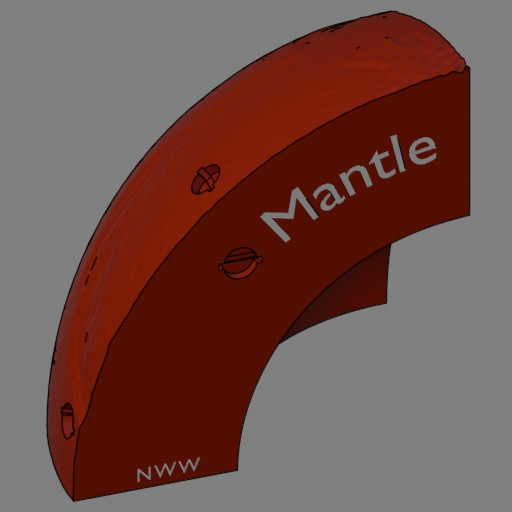                     | Mantle segment 1 (NWW) |        1 |           3 | Red, White                  | Large red eighth-sphere representing the north far-west mantle, with magnet slots for tectonic plate pieces and other mantle segments, cutout for core and "Mantle", "NWW" printed in white on an inside face.
                     | Mantle segment 2 (NW)  |        1 |           3 | Red, White                  | Large red eighth-sphere representing the north near-west mantle, with magnet slots for tectonic plate pieces and other mantle segments, cutout for core and "Mantle", "NW" printed in white on an inside face.
                     | Mantle segment 3 (NE)  |        1 |           3 | Red, White                  | Large red eighth-sphere representing the north near-east mantle, with magnet slots for tectonic plate pieces and other mantle segments, cutout for core and "Mantle", "NE" printed in white on an inside face.
                     | Mantle segment 4 (NEE) |        1 |           3 | Red, White                  | Large red eighth-sphere representing the north far-east mantle, with magnet slots for tectonic plate pieces and other mantle segments, cutout for core and "Mantle", "NEE" printed in white on an inside face.
                     | Mantle segment 5 (SEE) |        1 |           4 | Red, White                  | Large red eighth-sphere representing the south far-east mantle, with magnet slots for tectonic plate pieces and other mantle segments, cutout for core and "Mantle", "SEE" printed in white on an inside face.
                     | Mantle segment 6 (SWW) |        1 |           4 | Red, White                  | Large red eighth-sphere representing the south far-west mantle, with magnet slots for tectonic plate pieces and other mantle segments, cutout for core and "Mantle", "SWW" printed in white on an inside face.
                     | Mantle segment 7 (SW)  |        1 |           4 | Red, White                  | Large red eighth-sphere representing the south near-west mantle, with magnet slots for tectonic plate pieces and other mantle segments, cutout for core and "Mantle", "SW" printed in white on an inside face.
                     | Mantle segment 8 (SE)  |        1 |           4 | Red, White                  | Large red eighth-sphere representing the south near-east mantle, with magnet slots for tectonic plate pieces and other mantle segments, cutout for core and "Mantle", "SE" printed in white on an inside face.
 | North America 1        |        1 |           5 | Red, Dark Grey, Blue, Green | North American major plate (east half).
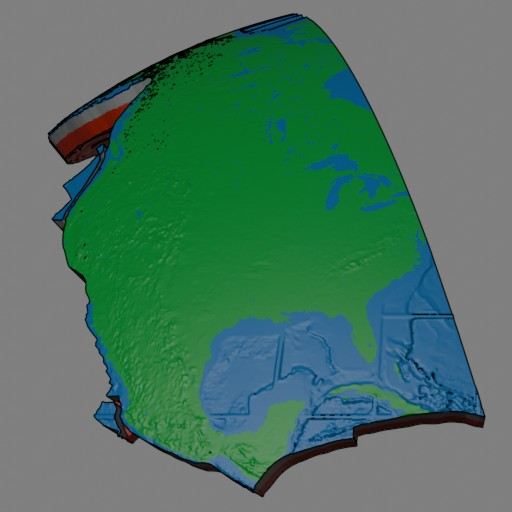 | North America 2        |        1 |           5 | Red, Dark Grey, Blue, Green | North American major plate (west half), microplates: Rivera, Juan de Fuca.
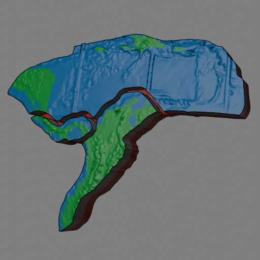            | Caribbean              |        1 |           5 | Red, Dark Grey, Blue, Green | Caribbean minor plate, microplates: Panama, North Andes.
                    | Cocos                  |        1 |           5 | Red, Dark Grey, Blue        | Cocos minor plate.
                    | Nazca                  |        1 |           5 | Red, Dark Grey, Blue, Green | Nazca minor plate, microplates: Easter, Juan Fernández, (Galapagos).
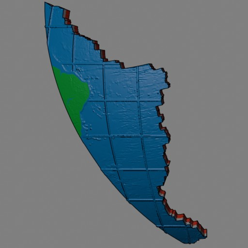 | South America 1        |        1 |           5 | Red, Dark Grey, Blue, Green | South American major plate (east half).
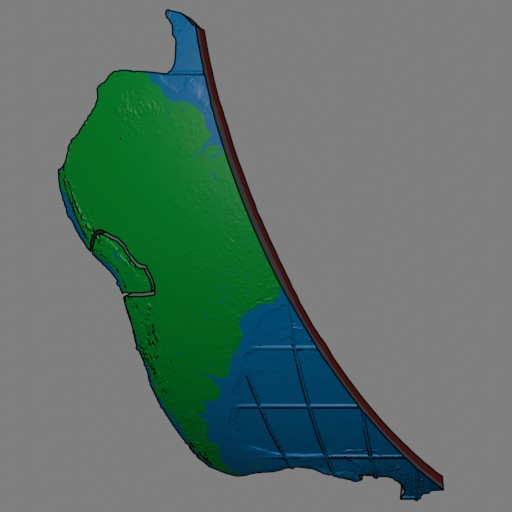 | South America 2        |        1 |           5 | Red, Dark Grey, Blue, Green | South American major plate (west half), Altiplano microplate.
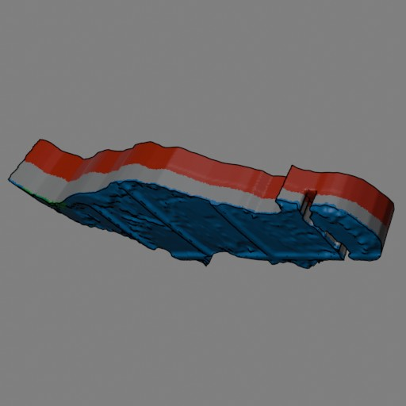                  | Scotia                 |        1 |           5 | Red, Dark Grey, Blue, Green | Scotia minor plate, Sandwich microplate.
               | Africa 1               |        1 |           5 | Red, Dark Grey, Blue, Green | African major plate (east half).
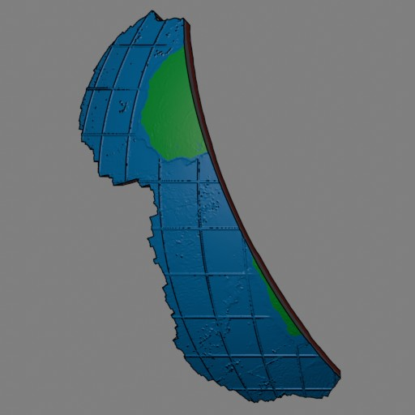               | Africa 2               |        1 |           5 | Red, Dark Grey, Blue, Green | African major plate (west half).
             | Eurasia 1              |        1 |           5 | Red, Dark Grey, Blue, Green | Eurasian major plate (north half).
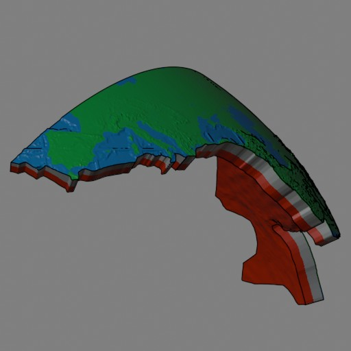             | Eurasia 2              |        1 |           5 | Red, Dark Grey, Blue, Green | Eurasian major plate (south half).
                  | Arabia                 |        1 |           5 | Red, Dark Grey, Blue, Green | Arabian minor plate, microplates: Aegean Sea, Anatolian.
                    | India                  |        1 |           5 | Red, Dark Grey, Blue, Green | Indian, Burma minor plates.
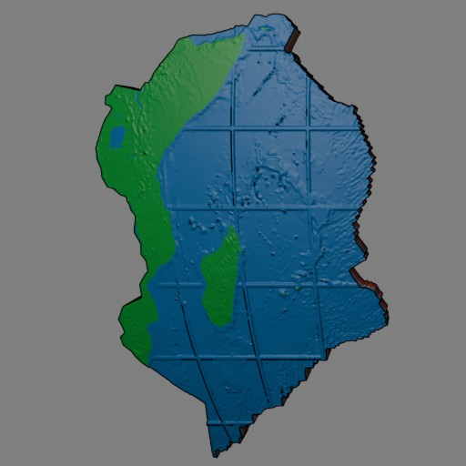                | Somalia                |        1 |           5 | Red, Dark Grey, Blue, Green | Somali minor plate.
         | Australia 1            |        1 |           5 | Red, Dark Grey, Blue, Green | Australian major plate (north half), New Hebrides minor plate, microplates: Balmoral Reef, Conway Reef, Niuafo'ou, Tonga (north half).
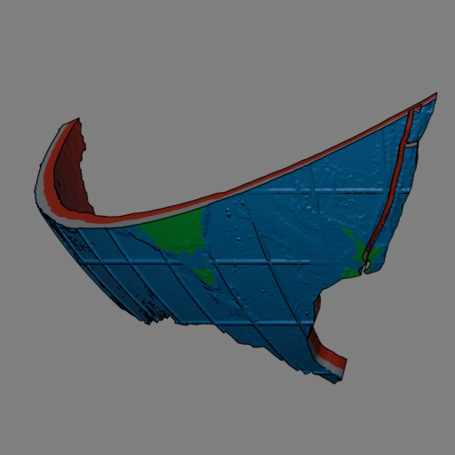         | Australia 2            |        1 |           5 | Red, Dark Grey, Blue, Green | Australian major plate (south half), microplates: Kermadec, Tonga (south half).
                    | Sunda                  |        1 |           5 | Red, Dark Grey, Blue, Green | Sunda minor plate.
                | Yangtze                |        1 |           5 | Red, Dark Grey, Blue, Green | Yangtze minor plate, Okinawa microplate.
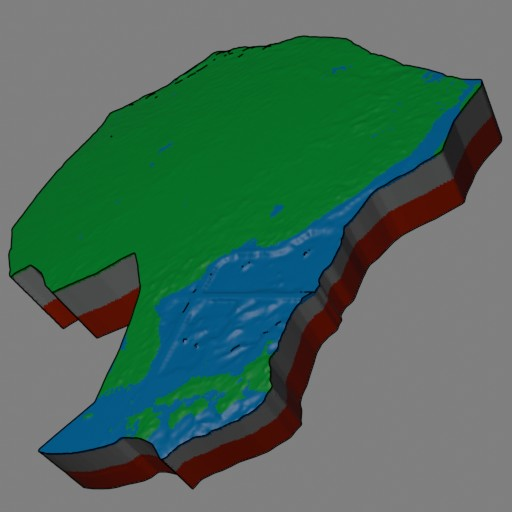                      | Amur                   |        1 |           5 | Red, Dark Grey, Blue, Green | Amurian minor plate.
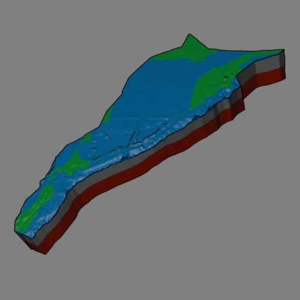                | Okhotsk                |        1 |           5 | Red, Dark Grey, Blue, Green | Okhotsk minor plate.
          | Philippine             |        1 |           5 | Red, Dark Grey, Blue, Green | Philippine Sea minor plate, Mariana microplate.
              | Caroline               |        1 |           5 | Red, Dark Grey, Blue, Green | Caroline minor plate, microplates: Banda Sea, Birds Head, Maoke, Molucca Sea, North Bismarck, South Bismarck, Solomon Sea, Timor, Woodlark, (Manus).
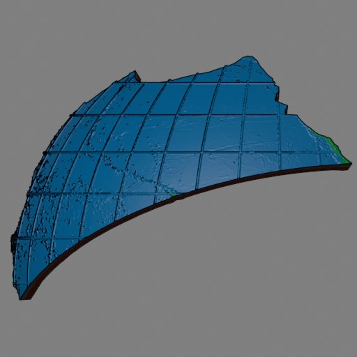             | Pacific 1              |        1 |           5 | Red, Dark Grey, Blue, Green | Pacific major plate (north third).
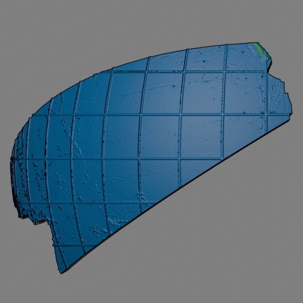             | Pacific 2              |        1 |           5 | Red, Dark Grey, Blue, Green | Pacific major plate (middle third).
             | Pacific 3              |        1 |           5 | Red, Dark Grey, Blue, Green | Pacific major plate (south third).
       | Antarctica 1           |        1 |           5 | Red, Dark Grey, Blue, Green | Antarctic major plate (far east half).
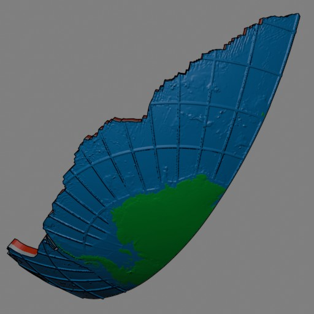       | Antarctica 2           |        1 |           5 | Red, Dark Grey, Blue, Green | Antarctic major plate (west half), Shetland microplate.

Bill of Materials
=================

To build this globe you will need the following materials. Please note the
quantities are based on my print with a BambuLab A1 / AMS Lite and custom flush
volumes, please check volumes before you buy filament.

Type             | Description              | Quantity
-----------------|--------------------------|----------
Filament         | Black                    | Approx 2.4g
Filament         | White                    | Approx 4.6g
Filament         | Yellow                   | Approx 14g
Filament         | Orange                   | Approx 210g
Filament         | Red                      | Approx 810g
Filament         | Dark Grey                | Approx 110g
Filament         | Green                    | Approx 120g
Filament         | Blue                     | Approx 310g
Circular magnets | 8mm diameter x 2mm thick | 82 (28x2=56 between tectonic plate pieces and mantle, 8x3=24 between mantle segments, 2 between inner core hemispheres)
